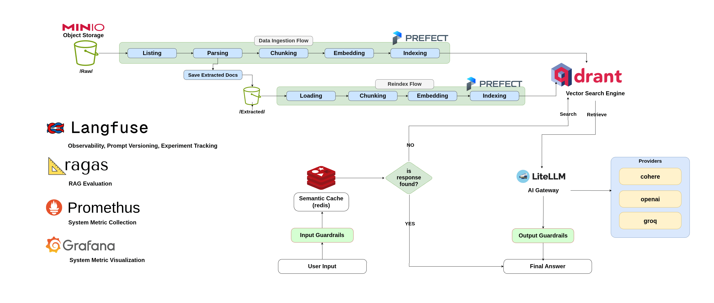

# Production-Ready RAG System

A retrieval-augmented generation system for question answering over nutrition documents.
You can add your own documents and update the system message according to your topic.

It is a Python monorepo with a streaming chat API, a document ingestion pipeline, and a full Docker deployment with monitoring.

## Features

- **Streaming chat API** built with FastAPI and Server-Sent Events
- **Semantic cache** on Redis, so repeated or similar questions are answered instantly
- **Vector search** on Qdrant, with a minimum-score filter to drop weak matches
- **Input guardrails** that mask emails, phone numbers, API keys, secrets and card numbers before anything reaches the model
- **LLM tracing, prompt management and cost tracking** with Langfuse
- **LLM gateway** through LiteLLM, so providers (Cohere, OpenAI, Groq) can be swapped from config
- **Ingestion pipeline** orchestrated with Prefect, reading source files from MinIO
- **Monitoring** with Prometheus and Grafana

## Architecture



- it contains two Prefect flows (data ingestion and reindex) fill Qdrant from files stored in MinIO so you can put you file here and version it.
- the chat path: input guardrails, semantic cache, vector search, LiteLLM, output guardrails, final answer.
- the tools around the system: Langfuse (tracing, prompt versions, experiments), RAGAS (RAG evaluation), Prometheus and Grafana (system metrics).

## Repository layout

This is a [uv workspace](https://docs.astral.sh/uv/concepts/projects/workspaces/) with three packages.

```
.
├── api/                              # FastAPI app: /chat and /health
│   ├── api/
│   │   ├── routes/                   # HTTP endpoints and request schemas
│   │   │   ├── chat.py
│   │   │   ├── health.py
│   │   │   └── schemas/chat.py
│   │   ├── services/
│   │   │   ├── rag_service.py        # embed, retrieve, generate
│   │   │   ├── caching_service.py    # Redis semantic cache
│   │   │   └── guardrails_service.py # masks sensitive input
│   │   ├── helpers/                  # config, prompt building, utils
│   │   ├── metrics.py                # Prometheus metrics
│   │   └── main.py                   # app + lifespan wiring
│   ├── tests/                        # routes/, services/, helpers/
│   └── pyproject.toml
├── data_pipeline/                    # Prefect flows
│   ├── data_pipeline/
│   │   ├── parse/                    # extract text from source files
│   │   ├── vectorize/                # chunk, embed, write to Qdrant, reindex
│   │   ├── helpers/                  # config, utils
│   │   ├── data_ingestion_pipeline.py
│   │   └── deploy.py
│   ├── tests/
│   └── pyproject.toml
├── shared/                           # code used by both packages
│   ├── shared/
│   │   ├── llm/                      # LLM and embedding clients
│   │   ├── prompts/                  # Langfuse prompt manager
│   │   ├── vectordb/                 # vector DB interface + Qdrant provider
│   │   └── config.py
│   ├── tests/                        # llm/, vectordb/
│   └── pyproject.toml
├── docker/
│   ├── docker-compose.yml            # all services
│   ├── api/Dockerfile
│   ├── data_pipeline/Dockerfile
│   ├── env/                          # .env.example.* templates
│   ├── litellm_proxy/config.yml      # LiteLLM model list
│   ├── nginx/default.conf
│   ├── prometheus/prometheus.yml
│   └── README.md                     # Docker stack guide
├── docs/imgs/architecture.png        # architecture diagram
├── loadtests/locustfile.py           # Locust load test
├── .github/workflows/                # GitHub Actions CI
├── .pre-commit-config.yaml
├── pyproject.toml                    # workspace root
├── uv.lock
└── README.md
```

## Monorepo design

The project is one repository with three packages, split by responsibility:

| Package | Responsibility | Runs as |
|---|---|---|
| `api` | Answers questions in real time | Long-running web service |
| `data_pipeline` | Turns documents into vectors | Scheduled and on-demand batch jobs (Prefect) |
| `shared` | Code both sides need | Library only, never run on its own |

```
        api ───────┐
                   ├──► shared
 data_pipeline ────┘g
```

**Why separate the data pipeline from the API?**

- **Different workloads.** The API must answer in seconds and stay up. The pipeline does heavy, slow work like parsing, chunking and embedding, and it can fail and retry without users noticing.
- **Independent deployment and scaling.** Each has its own Docker image. You can redeploy the API without touching ingestion, or scale workers without scaling the API.
- **Smaller dependencies.** The API image doesn't carry the parsing and orchestration libraries, and the pipeline image doesn't carry the web stack.
- **Fault isolation.** A crashing ingestion job can't take down the chat endpoint.

**Why a `shared` package?**

The API and the pipeline must agree on how data is written and read. `shared` holds the LLM and embedding clients, the vector DB interface with its Qdrant provider, and the prompt manager. Both sides use the same code, so the embedding model and collection settings used for indexing match what the API uses for search. A mismatch here silently ruins retrieval.

**Why one repository?**

- A change to `shared` and the code that uses it goes in one commit and one pull request.
- One `uv.lock` and one virtual environment keep versions consistent across packages.
- One CI pipeline tests everything together.

**Rules**

1. `api` and `data_pipeline` never import from each other. They only talk through the data in Qdrant and MinIO.
2. `shared` never imports from `api` or `data_pipeline`.
3. Each package declares its own dependencies in its own `pyproject.toml`, and uses `shared = { workspace = true }` to reach the local `shared` package.

## How it works

**Answering a question**

1. The question is masked by the guardrails, then embedded.
2. The semantic cache is checked. On a hit, the stored answer is returned.
3. On a miss, Qdrant returns the top-K chunks, and weak matches are dropped.
4. The prompt is compiled from the retrieved context and the model streams the answer back.
5. The finished answer is written to the cache.

If no chunk passes the score filter, the API replies that the content doesn't contain enough information. It does not call the model.

**Ingesting documents**

Two Prefect flows keep Qdrant up to date.

| Flow | Steps | Reads from | Writes to |
|---|---|---|---|
| **Data ingestion** | Listing → Parsing → Chunking → Embedding → Indexing | `/Raw/` in MinIO | Qdrant, plus the extracted text in `/Extracted/` |
| **Reindex** | Loading → Chunking → Embedding → Indexing | `/Extracted/` in MinIO | Qdrant |

Parsing is the slow step, so its output is saved to `/Extracted/`. When you change the chunking or the embedding model, run the reindex flow and the raw files are not parsed again.

## Tech stack

| Area | Tools |
|---|---|
| Language | Python 3.13 |
| API | FastAPI, Uvicorn |
| Vector DB | Qdrant |
| Cache | Redis Stack (RedisVL) |
| LLM gateway | LiteLLM |
| LLM observability and experiment tracking | Langfuse |
| RAG evaluation | RAGAS |
| Load testing | Locust |
| CI | GitHub Actions |
| Orchestration | Prefect |
| Object storage and Versioning | MinIO |
| Monitoring | Prometheus, Grafana |
| Packaging | uv workspaces |
| Quality | pytest, Ruff, pre-commit |
| Deployment | Docker Compose, nginx |

## Quick start (Docker)

The full stack, including the API, databases, pipeline and monitoring, runs from the `docker/` folder.

**Before you start:** set up Langfuse (a project and the prompt, see [Langfuse setup](#langfuse-setup)). The API needs its keys and the prompt to start.

```bash
cd docker/env
for f in .env.example.*; do cp -n "$f" "${f/.example/}"; done   # then edit the values
cd ..
docker compose up -d --build
curl http://localhost/api/v1/health
```

See [`docker/README.md`](docker/README.md) for the service list, ports, Grafana dashboards and troubleshooting.

## Local development

**Requirements:** Python 3.13 and [uv](https://docs.astral.sh/uv/).

```bash
uv sync --all-packages          # installs api, data_pipeline, shared and dev tools
uv run pre-commit install       # enable lint checks on commit
```

To run the API on your machine, start the supporting services first (Redis, Qdrant, LiteLLM) with Docker, then:

```bash
uv run uvicorn api.main:app --reload --port 8000
```

### Configuration

The API reads its settings from environment variables, or from `api/api/.env` when running locally. The values you need:

| Group | Variables |
|---|---|
| Retrieval | `USED_COLLECTION_NAME`, `TOP_K`, `MIN_RETRIEVAL_SCORE`, `EMBEDDING_MODEL_SIZE` |
| Generation | `GENERATION_MODEL_PROVIDER_URL`, `GENERATION_MODEL_ID`, `GENERATION_MODEL_API_KEY`, `MAX_INPUT_CHARACTERS`, `MAX_OUTPUT_TOKENS`, `TEMPERATURE` |
| Semantic cache | `REDIS_HOST`, `REDIS_PORT`, `SEMANTIC_CACHE_SEARCH_INDEX_NAME`, `CACHE_DISTANCE_THRESHOLD`, `CACHE_TTL` |
| Langfuse | `LANGFUSE_PUBLIC_KEY`, `LANGFUSE_SECRET_KEY`, `LANGFUSE_BASE_URL`, `PROMPT_NAME` |

Templates for the Docker setup live in `docker/env/.env.example.*`.

## Model configuration (LiteLLM)

All model calls, both embeddings and generation, go through the LiteLLM gateway. The API never talks to Cohere or Groq directly, so you can change models by editing a config file.

```
API / data pipeline ──► LiteLLM (:4000) ──► Cohere / Groq
```

- Model list: `docker/litellm_proxy/config.yml`
- Provider keys: `docker/env/.env.litellm`

### The config file

```yaml
model_list:
  - model_name: "cohere/embed-multilingual-v3.0"
    litellm_params:
        model: "cohere/embed-multilingual-v3.0" # put the model_name you prefer
        api_key: "os.environ/COHERE_API_KEY"
        # rpm: 10

  - model_name: "qwen/qwen3.8-27b"
    litellm_params:
        model: "groq/qwen/qwen3.8-27b"
        api_key: "os.environ/GROQ_API_KEY"
        # rpm: 20

  - model_name: "cohere/command-r-08-2024"
    litellm_params:
        model: "cohere/command-r-08-2024"
        api_key: "os.environ/COHERE_API_KEY"
        # rpm: 20

# Enable load balancing between models with the same model_name
# routing_strategy: simple-shuffle
```

| Field | Meaning |
|---|---|
| `model_name` | The name your code uses to ask for this model. It is an alias you choose. |
| `litellm_params.model` | The real route, written as `provider/model-id` (for Groq, `groq/<model id>`). |
| `api_key: "os.environ/NAME"` | Reads the provider key from the environment variable `NAME`, which comes from `.env.litellm`. Keys are never written in this file. |
| `rpm` | The maximum requests per minute LiteLLM allows for this model. |

The three models in this config:

| Alias (`model_name`) | Provider | Purpose |
|---|---|---|
| `cohere/embed-multilingual-v3.0` | Cohere | Embeddings for chunks and questions |
| `cohere/command-r-08-2024` | Cohere | Answer generation |
| `qwen/qwen3.8-27b` | Groq | Answer generation (alternative) |

The API uses one generation model at a time. The second one is there to switch to, or to compare in experiments.

Add the provider keys to `docker/env/.env.litellm`:

```dotenv
COHERE_API_KEY=...
GROQ_API_KEY=...
```

### How the API settings connect to it

| Setting | What to put there |
|---|---|
| `GENERATION_MODEL_PROVIDER_URL` | The address of LiteLLM: `http://litellm:4000` in Docker, `http://localhost:4000` when running the API on your machine. |
| `GENERATION_MODEL_ID` | A `model_name` from `config.yml`, for example `cohere/command-r-08-2024`. Use the alias, not the `litellm_params.model` route. |
| `GENERATION_MODEL_API_KEY` | The key for **LiteLLM**, not the Cohere or Groq key. Use your LiteLLM master key (or a virtual key) if you set one. Otherwise any non-empty value works. |
| `EMBEDDING_MODEL_SIZE` | The vector dimension of the embedding model. It is `1024` for `cohere/embed-multilingual-v3.0`. Check the model's documentation for other models. |

Example in `docker/env/.env.app`:

```dotenv
GENERATION_MODEL_PROVIDER_URL=http://litellm:4000
GENERATION_MODEL_ID=cohere/command-r-08-2024
GENERATION_MODEL_API_KEY=<your LiteLLM key>
EMBEDDING_MODEL_SIZE=1024
```

To switch, change `GENERATION_MODEL_ID` and restart the API. No code changes are needed.

### Choosing an embedding model

- **Language coverage.** A multilingual model if your documents or questions aren't only English.
- **Dimension.** Larger vectors can retrieve better but use more storage and are slower to search.
- **Input length.** Chunks must fit within the model's token limit.

The embedding model is a bigger decision than the generation model. Documents and questions must be embedded by the **same** model, and `EMBEDDING_MODEL_SIZE` must match its dimension. If you change the model:

1. Update `config.yml` and `EMBEDDING_MODEL_SIZE`.
2. Use a new Qdrant collection name (`USED_COLLECTION_NAME`) and run the reindex flow, so every chunk is embedded again.
3. Use a new `SEMANTIC_CACHE_SEARCH_INDEX_NAME`, or clear the cache. Its index has a fixed vector size and holds vectors from the old model.
4. Restart the API.

### Rate limits (`rpm`)

Set `rpm` to your provider plan's real limit. LiteLLM enforces it, so requests above the limit can fail with a rate-limit error.

Every chat request calls the embedding model once, even when the answer comes from the cache. With `rpm: 10` on the embedding model, the whole API can handle only about 10 questions per minute. Raise it to your plan's limit before load testing or going live. Free and trial keys are often much lower than production ones, so check your provider dashboard.

Restart LiteLLM after editing `config.yml`:

```bash
docker compose restart litellm
```

## Langfuse setup

Langfuse is used in two ways: **observability** (every chat request is traced) and **prompt management** (the RAG prompt lives in Langfuse, not in the code). Set it up once before starting the API.

### 1. Create a project for observability

1. Sign in to Langfuse (cloud or your own self-hosted instance).
2. Create an **organization** if you don't have one, then a **project**, for example `rag-system`.
3. Open the project's **Settings → API Keys** and create a key pair.
4. Put the values in `docker/env/.env.app` (or `api/api/.env` for local runs):

   ```dotenv
   LANGFUSE_PUBLIC_KEY=pk-lf-...
   LANGFUSE_SECRET_KEY=sk-lf-...
   LANGFUSE_BASE_URL=https://cloud.langfuse.com   # or your self-hosted URL
   ```

   Use the base URL of the region or server where you created the project.

Tip: use a separate project for each environment (for example `rag-system-dev` and `rag-system-prod`), so test traffic doesn't mix with production traces.

### 2. Create the prompt

1. In the project, open **Prompts → New prompt**.
2. Set the **name** to exactly the value of `PROMPT_NAME` in your env file. The API looks the prompt up by this name.
3. Write the prompt. The API fills in these variables when it answers:

   | Variable | Content |
   |---|---|
   | `{{question}}` | The user's question (after guardrail masking) |
   | `{{context}}` | The retrieved document chunks, numbered |
   | `{{chat_history}}` | Previous messages (currently empty) |

4. Add the label **`production`** to the version you want to serve.

The API loads the version labeled `production` when it starts. If the prompt doesn't exist or has no `production` label, the API will not start. After you promote a new version, restart the API to pick it up:

```bash
docker compose restart fastapi
```

### 3. Check that tracing works

Send a question, then open **Tracing** in the Langfuse project:

```bash
curl -N -X POST http://localhost/api/v1/chat \
  -H "Content-Type: application/json" \
  -d '{"question": "Which foods are rich in vitamin C?"}'
```

You should see a `rag-chat` trace with these steps: `question-embedding`, `semantic-cache-lookup`, `vector-retrieval`, `prompt-compilation`, `rag-generation` and `semantic-cache-write`. The generation step shows the prompt version, token usage and latency.

The same project holds your experiment runs and evaluation scores, so traces, prompt versions and results stay linked.

## API

| Method | Path | Description |
|---|---|---|
| `GET` | `/api/v1/health` | Health check |
| `POST` | `/api/v1/chat` | Ask a question; streams the answer as SSE |

Request body for `/chat`:

```json
{ "question": "Which foods are rich in vitamin C?" }
```

The stream sends a `documents` event (the sources used), then the answer text, then `done`. Errors arrive as an `error` event.

## Testing

```bash
uv run pytest                        # everything
uv run pytest api/tests -v           # API only
uv run pytest -m "not integration"   # skip tests that need real services
```

The tests use (Mocking objects) so in-memory fakes for Redis, Qdrant, Langfuse and the LLM, so they run without Docker. Right now they cover the `api` package. Tests for `shared` and `data_pipeline` are planned.

## Code quality

Ruff and the other checks run through pre-commit. To run them manually:

```bash
uv run pre-commit run --all-files
```

## Evaluation and experiments

- **RAGAS** scores the quality of the RAG pipeline (retrieval and answer quality) against a test set of questions.
- **Langfuse** tracks the experiments: each run is traced and stored, so you can compare prompt versions, models and retrieval settings side by side.

## Load testing

[Locust](https://locust.io/) simulates many users hitting `/api/v1/chat`, so you can find the request rate and latency the system handles before it degrades. Watch the Grafana dashboards while a test runs.

## Continuous integration

GitHub Actions runs on every push and pull request. It runs the lint checks and the test suite, so a broken change is caught before it merges.

## Monitoring

Prometheus scrapes the API, Qdrant, node-exporter and Postgres. Grafana ships with four recommended dashboards (FastAPI, Node Exporter, Qdrant, PostgreSQL). Setup steps are in [`docker/README.md`](docker/README.md#monitoring-with-grafana).
